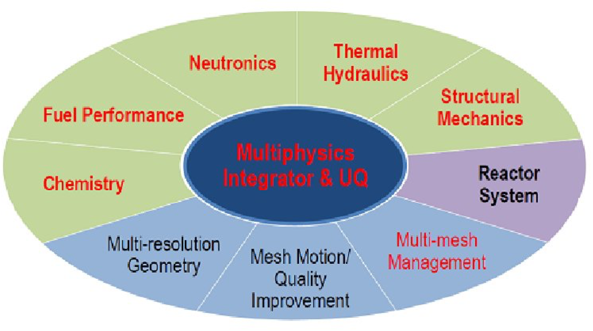
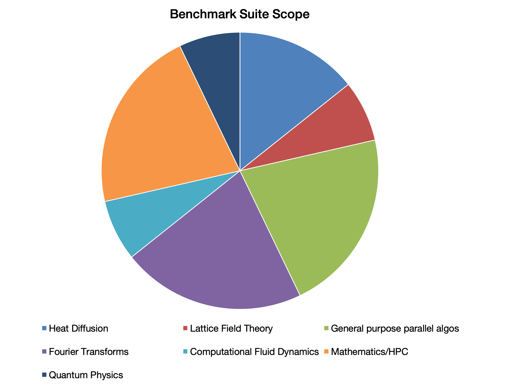
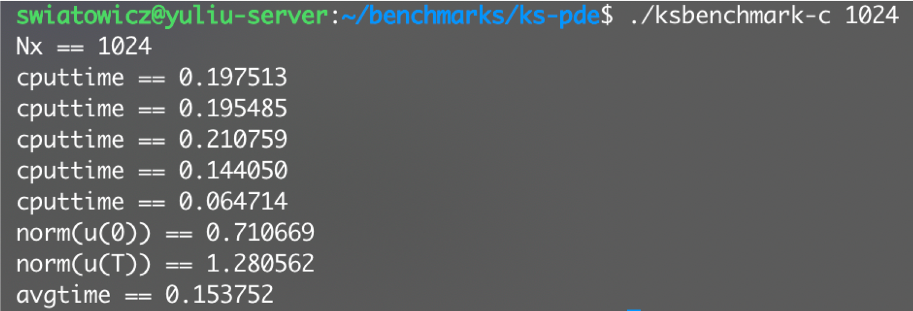

# Clarkson Open-Source Multi-physics Benchmark Suite (COMBS)

## Abstract
The lack of accessible open-source multi-physics benchmark suites has presented a challenge in uniformly evaluating simulation performance across related disciplines. Most of the available benchmarking tools require licensing and do not provide access to source codes, facilitating the need for a comprehensive suite of benchmarks to easily and reliably test simulation performance. Through the compilation of 14 benchmarks that measure performance indicative of multiple physics algorithm designs, research in the field will benefit from an open-source suite that is modifiable and free to use. The benchmark codes have been tested to successfully build on an Ubuntu server/packageable virtual environment, with the future goal of running the suite on a modular computer architecture simulator (i.e., gem5), allowing for codes to be run in a stable, uniform, virtual X86 environment.

## Background
Research on designing a benchmark suite for multiphysics simulations is inspired by the lack of available open-source suites that measure performance evaluation. Some of the available benchmarks are locked behind licenses and use in-house codes that make easy comparisons across different simulations challenging.  Benchmark suites have been created to measure the performance of multiphysics simulations but suffer from certain flaws. COMSOL and other commercial packages provide benchmarks to test simulations but the codes are not open-source and require a license to use [2]. Open-source benchmark suites like CORAL-2 serve as compilations of codes and still require users to individually install, build, and run each benchmark in the suite [3]. The CORAL-2 benchmarks also include wide variations in lines of code (LOC) and other attributes like uneven testing of hardware. It is important to develop an open-source suite of benchmarks since multiple physics simulations are becoming required to simulate the coupling of different codes.

## Methodology
In order to construct a benchmark suite that would provide adequate coverage and measure desired performance, potential benchmarks had to meet certain criteria, as follows:

* open-source,
* able to be built and compiled with few additional external libraries,
* written in C or C++ as to allow for the use of a single compiler,
* measures performance typical of an aspect of multiphysics simulations (ex: tightly coupled code)

The last point was of particular importance, as it is difficult to determine the most salient aspects of a field with limited background experience in multiphysics algorithm design. Upon consulting literature in the field, it was determined that finding algorithms that solve partial differential equations (PDEs) was necessary, as multiphysics simulation solution times depend on how quickly PDEs can be solved [5]. Secondary characteristics used for the selection of benchmarks included their relatedness to the field in terms of the problem they solved or their presence in licensed benchmark suites. Queries were conducted primarily through GitHub.

## Results
The completed suite consists of 14 benchmarks from 7 distinct multiphysics and high-performance computing adjacent fields, as shown in Fig. 2.  Each benchmark is open-source, allowing for free access and modification as desired. Each benchmark consists of algorithm(s) that solve problems related to the field. As an example, one of the selected benchmarks is a solver for the Kuramoto-Sivashinsky (KS) equation. The KS equation is one of the principal equations in connecting partial differential equations (PDEs) and dynamical systems.

  
Since multiphysics simulations rely heavily on the tight coupling between dynamic algorithms, this benchmark appears to be reasonable to test baseline performance, at least on a much simpler, 1D problem. The KS equation is a highly cited problem in the field dating back over 30 years and being a PDE problem, fits directly in to multiphysics, since such systems depend on the how quickly a PDE system can be solved [6]. Similar reasoning is given for the other benchmarks, which are hosted on a GitHub repository that will be available upon the completion of this project. 

## Discussion
The utility of this benchmark suite is dependent on its use in the various fields of multiphysics for users to measure the performance of their simulations. In the future, we would like to have the suite build and compile with a simulated computer architecture. This would allow simulations to be tested in a controlled environment with uniform hardware specifications. We have also developed a dedicated website to host the benchmark suite, where users will have access to all documentation for each benchmark along with a downloadable virtual machine file to facilitate easy use of the suite without the need to individually download, build, and compile each individual benchmark.  

### Acknowledgements and References
This project was funded through NSF Award #1852102.

[1] Binkert, N., Sardashti, S., Sen, R., Sewell, K., Shoaib, M., Vaish, N., . . . Krishna, T. (2011). The gem5 simulator. ACM SIGARCH Computer Architecture News,39(2), 1. doi:10.1145/2024716.2024718  
[2] COMSOL Multiphysics Reference Manual, version 5.4", COMSOL, Inc, www.comsol.com  
[3] CORAL-2 Benchmarks. (n.d.). Retrieved from https://asc.llnl.gov/coral-2-benchmarks/  
[4] Turinsky, P. J. (2012). Advances In Multi-Physics And High Performance Computing In Support Of Nuclear Reactor Power Systems Modeling And Simulation. Nuclear Engineering and Technology,44(2), 103-122. doi:10.5516/net.01.2012.500  
[5] Kan, D. (2008). Multiphysics Simulation Software. Retrieved from https://www.comsol.com/shared/downloads/multiphysics_white_paper.pdf  
[6] Hyman, J. M., & Nicolaenko, B. (1986). The Kuramoto-Sivashinsky equation: A bridge between PDES and dynamical systems. Physica D: Nonlinear Phenomena, 18(1-3), 113-126. doi:10.1016/0167-2789(86)90166-1
